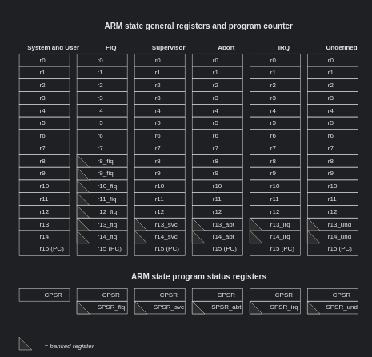

# Features 
- Harvard Architecture (separate data and instruction memory)
- Multi-issue frontend inspired by Tomasulo's Algorithm
- Reservation stations for integer operations
- 1 Instruction Queue
- 1 Common Data Bus (CDB): At most one result may be broadcast per cycle, so simultaneous FU completions require CDB arbitration
- Forwarding for RAW hazard resolution via CDB broadcasts
- 2 Functional Units (integer ALUs) 
- 1 Reorder Buffer (ROB) with in-order commit
- 1 Register Alias Table (RAT) with tag based register renaming
- 1 Load Buffer and basic store handling through the ROB
- 1 Register file
- 1 Instruction Decoder
- Static branch prediction with flush-based recovery on mispredict
- Simple memory unit for data


Issue width: 2
Integer RS entries: 4
Load buffer entries: 2
ROB entries: 8
General Purpose Registers : 13 (R0-R12)
Special registers: Stack pointer (SP), Link register (LR), and PC (program counter)
RAT entries: 8 (1 Valid bit + 3 bit tag)
ALUs: 2
CDBs: 1
Instruction memory: 256 instructions
Data memory: 256 words


# Nice to have
- I/D Cache 
- Translation Lookaside buffer (TLB)
- Floating point unit (FPU) to execute IEEE754 arithmetic
- 2 CDB in the future
- Advanced branch prediction (needs research)
- Interrupt controller

# Timeline
1. fetch / decode / rename + Instruction queue
2. RS + RAT + ROB interaction
3. ALU execution + CDB forwarding
4. in-order commit
5. loads
6. branch recovery


# TBD
- ~~Instruction format (ISA)~~
- ROB + RAT + RS Field format
- I/D Cache Depth (After essentials are completed)


# Instruction Set (ARM7TDMI-S)
The following table describes the instructions from the ARM7TDMI-S processor instruction set that are currently implemented in OutrO.
Note that the  ARM7TDMI-S Architecture is used as an inspiration but will not be strictly followed as ARM7TDMI-S is implemented as a 3-stage pipeline with 
Von Neumann memory model.


| Mnemonic | Instruction Name                | Action                                      | Section | Implemented |
|----------|--------------------------------|---------------------------------------------|---------|-------------|
| ADC      | Add with Carry                 | Rd := Rn + Op2 + Carry                      | 4.5     | ❌ |
| ADD      | Add                            | Rd := Rn + Op2                              | 4.5     | ✅ |
| AND      | AND                            | Rd := Rn AND Op2                            | 4.5     | ✅ |
| B        | Branch                         | R15 := address                              | 4.4     | ✅ |
| BIC      | Bit Clear                      | Rd := Rn AND NOT Op2                        | 4.5     | ❌ |
| BL       | Branch with Link               | R14 := R15, R15 := address                  | 4.4     | ✅ |
| BX       | Branch and Exchange            | R15 := Rn, T bit := Rn[0]                   | 4.3     | ❌ |
| CDP      | Coprocessor Data Processing    | Coprocessor-specific                        | 4.14    | ❌ |
| CMN      | Compare Negative               | CPSR flags := Rn + Op2                      | 4.5     | ✅ |
| CMP      | Compare                        | CPSR flags := Rn - Op2                      | 4.5     | ❌ |
| EOR      | Exclusive OR                   | Rd := (Rn AND NOT Op2) OR (Op2 AND NOT Rn)  | 4.5     | ❌ |
| LDC      | Load Coprocessor from Memory   | Coprocessor load                            | 4.15    | ❌ |
| LDM      | Load Multiple Registers        | Stack manipulation (Pop)                    | 4.11    | ❌ |
| LDR      | Load Register from Memory      | Rd := (address)                             | 4.9/4.10| ✅ |
| MCR      | Move CPU to Coprocessor        | cRn := rRn {<op>cRm}                        | 4.16    | ❌ |
| MLA      | Multiply Accumulate            | Rd := (Rm * Rs) + Rn                        | 4.7/4.8 | ❌ |
| MOV      | Move                           | Rd := Op2                                   | 4.5     | ❌ |
| MRC      | Move from Coprocessor          | Rn := cRn {<op>cRm}                         | 4.16    | ❌ |
| MRS      | Move PSR to Register           | Rn := PSR                                   | 4.6     | ❌ |
| MSR      | Move Register to PSR           | PSR := Rm                                   | 4.6     | ❌ |
| MUL      | Multiply                       | Rd := Rm * Rs                               | 4.7/4.8 | ❌ |
| MVN      | Move Negative                  | Rd := 0xFFFFFFFF EOR Op2                    | 4.5     | ✅ |
| ORR      | OR                             | Rd := Rn OR Op2                             | 4.5     | ❌ |
| RSB      | Reverse Subtract               | Rd := Op2 - Rn                              | 4.5     | ❌ |
| RSC      | Reverse Subtract with Carry    | Rd := Op2 - Rn - 1 + Carry                  | 4.5     | ❌ |
| SBC      | Subtract with Carry            | Rd := Rn - Op2 - 1 + Carry                  | 4.5     | ❌ |
| STC      | Store Coprocessor Register     | address := CRn                              | 4.15    | ❌ |
| STM      | Store Multiple                 | Stack manipulation (Push)                   | 4.11    | ❌ |
| STR      | Store Register to Memory       | Memory[address] := Rd                       | 4.9/4.10| ✅ |
| SUB      | Subtract                       | Rd := Rn - Op2                              | 4.5     | ✅ |
| SWI      | Software Interrupt             | OS call                                     | 4.13    | ❌ |
| SWP      | Swap Register with Memory      | Rd := [Rn], [Rn] := Rm                      | 4.12    | ❌ |
| TEQ      | Test Bitwise Equality          | CPSR flags := Rn EOR Op2                    | 4.5     | ✅ |
| TST      | Test Bits                      | CPSR flags := Rn AND Op2                    | 4.5     | ❌ |


# Register summary

The figure below describes the ARM state register set. There are 16 general registers with register 15 holding the Program Counter (PC).
The current implementation of OutrO will only focus on implementing the 16 general registers without supporting program status registers (PSRs) or operating modes (User, Fast Interrupt, Supervisor, etc.) [You can read more about the ARM state register set here](https://developer.arm.com/documentation/ddi0234/b/programmer-s-model/registers/the-arm-state-register-set?lang=en).




# Register File 
For dual-issue CPU, the register file shall have two issue slots:
4 read ports (2 source operands per ALU)
2 commit write ports
R15 stored in regfile
R15 updated only by instruction fetch via i_pc_next

```
                         Register File
              +--------------------------------+
              |                                | 
 i_clk ------>|                                |
 i_nrst ----->|                                |
              |                                |
 i_pc_next -->| R15 / PC update                |--> o_pc
              |                                |
              |                                |
 i_rs1_0 ---->| Read addr slot 0 rs1           |--> o_rs1_0
 i_rs2_0 ---->| Read addr slot 0 rs2           |--> o_rs2_0
              |                                |
 i_rs1_1 ---->| Read addr slot 1 rs1           |--> o_rs1_1
 i_rs2_1 ---->| Read addr slot 1 rs2           |--> o_rs2_1
              |                                |
 i_write_en_0>| Commit write enable 0          |
 i_rd_0 ----->| Commit destination 0           |
 i_commit0_wdata --> |Commit write data 0      |
              |                                |
 i_write_en_1>| Commit write enable 1          |
 i_rd_1 ----->| Commit destination 1           |
 i_commit1_wdata --> Commit write data 1       |
              |                                |
              +--------------------------------+
```